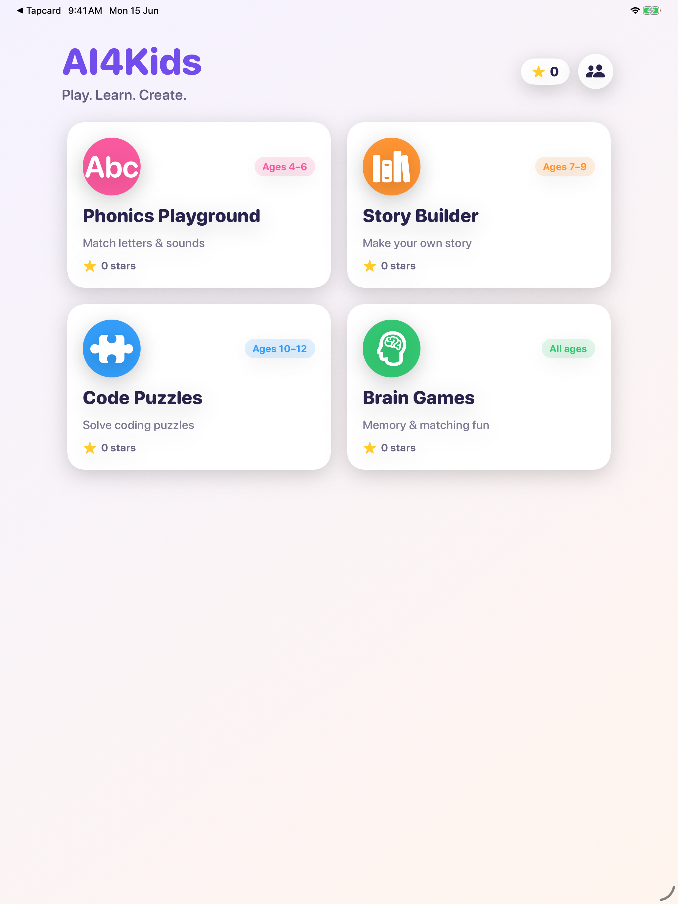

<div align="center">


# AI4Kids

### A native iPhone & iPad activity app where kids play, learn, and create — fully offline, no logins, no data collection.

[](https://www.apple.com/ios/)
[](https://swift.org)
[](https://developer.apple.com/xcode/swiftui/)
[](https://appstoreconnect.apple.com)
[](#-privacy)

Inspired by the [AI Kids Academy](https://ai4kids.tertiarycourses.com.sg/) programme by Tertiary Infotech.

</div>

---

## ✨ Overview

**AI4Kids** is a bright, friendly **universal app (iPhone + iPad)** for young learners (ages 4–16), with layouts that adapt to each screen size. It bundles four self-contained learning activities that run **entirely on-device** — no internet, no accounts, no ads, and **no data collection** — so children can explore safely on their own and parents can relax.

<div align="center">

</div>

## 🎮 The Four Activities

| | Activity | Ages | What kids do |
|---|---|---|---|
| 🔤 | **Phonics Playground** | 4–6 | Tap the picture that starts with the shown letter — builds letter/sound recognition. |
| 📖 | **Story Builder** | 7–9 | Pick a hero, a place, and a magic item; the app weaves an illustrated story, page by page. |
| 🧩 | **Code Puzzles** | 10–12 | Sequence direction steps to walk a robot to the star — a gentle intro to algorithmic thinking. |
| 🧠 | **Brain Games** | All | Flip cards to find matching pairs — memory, focus, and concentration. |

Every win earns ⭐️ stars, tracked locally and celebrated with confetti.

<div align="center">


</div>

## 🔒 Privacy

AI4Kids is designed to be **kid-safe by construction**:

- **No network access** — every activity is fully offline.
- **No accounts, no sign-ups, no ads, no in-app purchases.**
- **No data collected** — progress (just a star tally) lives on-device in `UserDefaults`.
- A built-in **Parents' Corner** explains the no-data stance and can reset progress.
- App Store privacy label: **Data Not Collected**. App Privacy manifest (`PrivacyInfo.xcprivacy`) declares no tracking and no collected data types.

## 🏗 Architecture

```
SwiftUI Views (one per activity)  ─>  ProgressStore (@Observable, UserDefaults)
        RootView (home grid)      ─>  fullScreenCover  ─>  activity views
```

- **`App/`** — entry point, `RootView` (home grid + Parents' Corner), `Theme` (kid palette + helpers)
- **`Models/Activity.swift`** — the four activities and their card metadata
- **`Services/ProgressStore.swift`** — the single `@Observable` injected into the environment (the only place that persists)
- **`Components/SharedUI.swift`** — `KidButton`, `StarBadge`, `CelebrationView`, `CloseButton`
- **`Views/`** — one self-contained SwiftUI view per activity

Built with **Swift 6 complete strict concurrency**, `@MainActor` isolation throughout, and the Observation framework (not Combine). No third-party dependencies.

## 🛠 Build & Run

The Xcode project is **generated from `project.yml`** with [XcodeGen](https://github.com/yonsm/XcodeGen) — never hand-edit the `.xcodeproj`.

```bash
brew install xcodegen          # once
xcodegen generate              # regenerate the project after editing project.yml

# Build for a generic device (signing off)
xcodebuild -project AI4KidsApp.xcodeproj -scheme AI4KidsApp \
  -destination 'generic/platform=iOS' -configuration Debug \
  CODE_SIGNING_ALLOWED=NO build

# Or run on a booted iPad simulator
xcodebuild -project AI4KidsApp.xcodeproj -scheme AI4KidsApp -configuration Debug \
  -destination 'id=<SIMULATOR_UDID>' -derivedDataPath /tmp/dd build
xcrun simctl install <UDID> /tmp/dd/Build/Products/Debug-iphonesimulator/AI4KidsApp.app
xcrun simctl launch <UDID> com.tertiaryinfotech.ai4kids
```

Requirements: **Xcode 26+**, **iPadOS 18.0+** target.

## 🚀 App Store

| | |
|---|---|
| **Name** | AI4Kids |
| **Bundle ID** | `com.tertiaryinfotech.ai4kids` |
| **Category** | Education |
| **Price** | Free |
| **Age rating** | 4+ |
| **Status** | Submitted — *Waiting for Review* |

Submission is automated via the bundled [`app-store-submission`](.agents/skills/app-store-submission) skill (App Store Connect API + Xcode CLI). See its `SKILL.md` for the full, repeatable workflow.

## 🙏 Acknowledgements

- Concept inspired by [AI Kids Academy](https://ai4kids.tertiarycourses.com.sg/) — Tertiary Infotech
- Built with [SwiftUI](https://developer.apple.com/xcode/swiftui/) and [XcodeGen](https://github.com/yonsm/XcodeGen)

---

<div align="center">
<sub>© 2026 Tertiary Infotech Academy Pte Ltd</sub>
</div>
